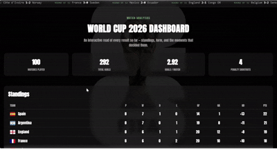

# World Cup 2026 Dashboard

An interactive dashboard analyzing all 104 matches of the 2026 FIFA World Cup — standings, filterable match results, and live charts, built with vanilla JavaScript.

**[Live Demo](https://yeshi30.github.io/worldcup2026-dashboard/)**

## Features
- Sortable standings table with team flags
- Filterable match list by round and team search
- Interactive goals-by-round chart
- Scrolling results ticker

## Tech stack
HTML, CSS, JavaScript, Chart.js

## Data
Real match results for the full 2026 FIFA World Cup tournament, including the final (Spain 1-0 Argentina, after extra time).

## Running it
Just open `index.html` in a browser — no build step or server required.
